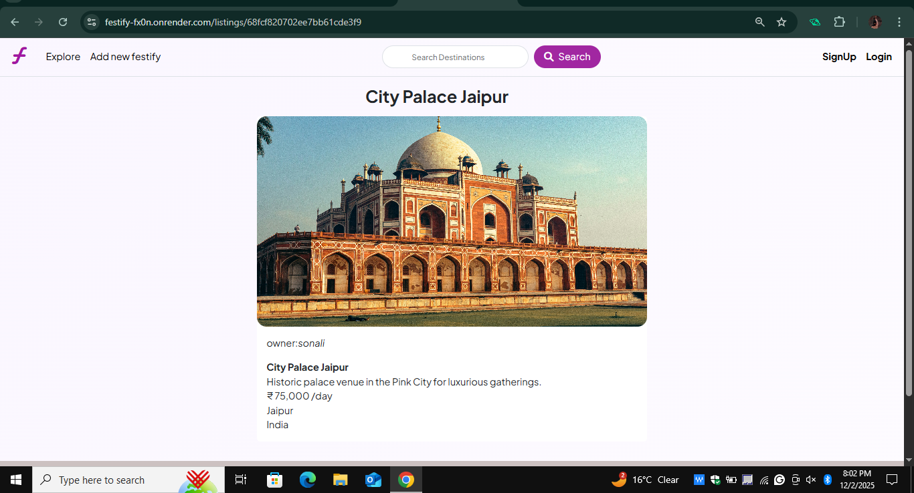

# 🎉 Festify — Event Destination Finder Web App


Festify is a modern web application that helps users discover the **best destinations for organizing festivals, weddings, parties, and luxury events**.  
Users can explore curated locations, apply category filters, and view high-quality venue details. Admins can add new destinations with images and descriptions.

🌐 **Live Demo:**  
👉 https://festify-fx0n.onrender.com/

---

## 🚀 Features

### 👤 User Features
- User Registration & Login  
- Session-based Authentication  
- Explore curated event destinations  
- Apply category filters  
- View detailed venue information  

### 🛠️ Admin Features
- Admin dashboard  
- Add new destinations  
- Upload images  
- Edit / delete listings  

### 🧭 Upcoming Features
- Booking system  
- Payment gateway  
- Wishlist / Reviews  
- Google login  

---

## 🧰 Tech Stack

| Layer | Technology |
|-------|------------|
| **Frontend** | EJS, CSS |
| **Backend** | Node.js, Express.js |
| **Database** | MongoDB |
| **Authentication** | Sessions |
| **Image Storage** | Cloudinary |
| **Deployment** | Render |

---

## 📁 Project Structure
Festify/
├── controllers/        # Route handlers / logic
├── init/               # Initialization files
├── models/             # Mongoose models
├── public/             # Static assets (CSS, JS, Images)
├── routes/             # Express routes
├── utils/              # Utility functions
├── views/              # EJS templates (frontend UI)
├── .gitignore          # Git ignore rules
├── app.js              # Main server file
├── cloudConfig.js      # Cloudinary configuration
├── middleware.js       # Custom middlewares
├── schema.js           # Validation Schemas
├── package.json        # Project metadata + dependencies
└── README.md           # Project documentation


### 🏠 Home Page


---

### 🔐 Signup Page


---

### 🗂 Destinations Listing Page


---

### 🏰 Destination Detail Page


---

## 🛠 Installation & Setup

### 1️⃣ Clone the repository
```bash
git clone https://github.com/Sonali-Mehta-hub/Festify.git
cd Festify

